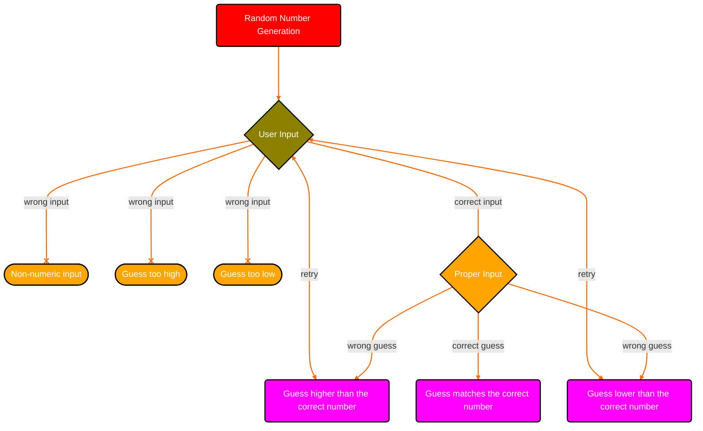

### First the computer generates a random number in a pre-defined range. The user than tries to guess the number. If the user enters a number out of the range or enters a non-numeric input than the program ends. If the user enters a valid guess, than the number is compared to the generated number. If it is correct the program ends. If it is too low or too high the user tries to guess the number again. 
